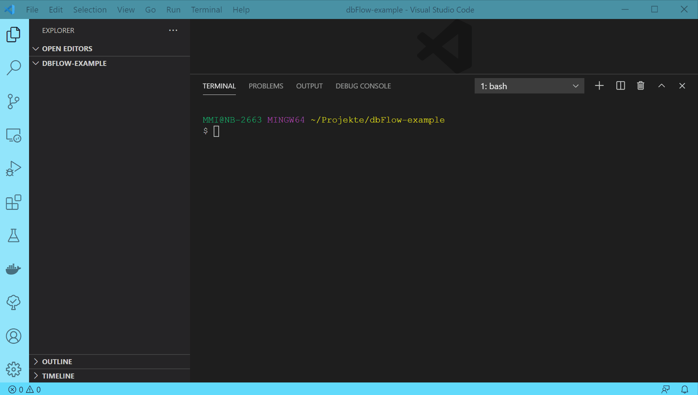

# dbFlow
Deployment framework for Oracle Database Applications


## Features you get

- create an Oracle Database / APEX Project per command line
- install dependent features (Logger, utPLSQL, ...)
- use a deployment flow, which automaicaly build and apply patches based on Git diffs
- configure your project dependencies
- compile PL/SQL and SQL towards your database connection
- minify and upload CSS and JavaScript files to Application Static Files
- upload images and other binary files
- export APEX Applications and REST Modules


## Quick Preferred way of installation


> 


1. create a git repositoy
2. add dbFlow as `.dbFlow` submodule to your project
3. run `.dbFlow/setup.sh generate <project_name>`
4. answer some question based on your requirements
5. after that just run `.dbFlow/setup.sh install`

### By executing the install command following objects are created

- On a multischema project 4 database users <project_name>_(depl, data, logic, app). Thereby the deployment (depl) user will be used as a proxy user
- On a singelschema project only one database user <project_name> is created
- when accepted some dependent features (Logger, utPLSQL, ...) are installed
- APEX Workspace is installed and a workspace admin name wsadmin (initial pwd is *wsadmin*)


## Prerequisites

First of all you need a database. If you set up the project from scratch, you will need the login data of an admin in between. If you use the APEX functionality, this database should have a current version of APEX installed.

If you use VSCode and build tasks to minify JavaScript or CSS files, you should have the following npm packages installed globally
  - `uglifycc` to minimize CSS
  - `terser` to minimize JavaScript
  - `@babel/*` to transpile the JavaScript code per polyfills in a defined standard


  ``` shell
  npm install -g uglifycss terser @babel/core @babel/cli @babel/preset-env
  ```

- dbFlow is using bash. So on Windows make sure you are using Git-Bash
- If you want to use schema-export you must hav APEX installed, cause we are using apex_zip Package


## Todo

- [ ] Finalize documentation
- [ ] Create some tutorials
- [ ] Create son blogposts